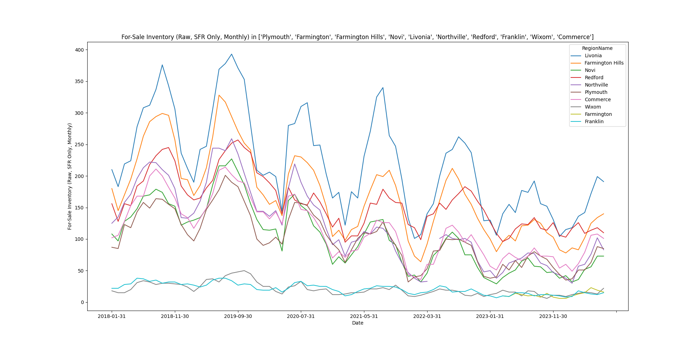
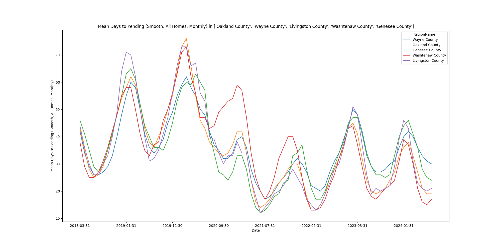
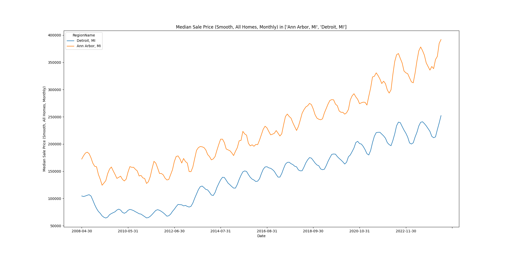
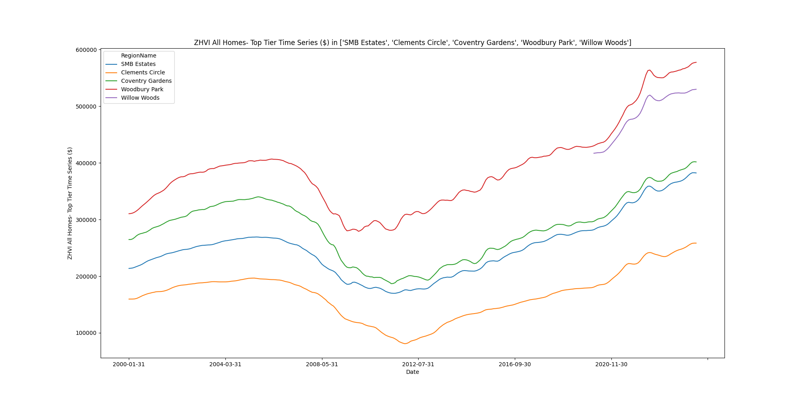
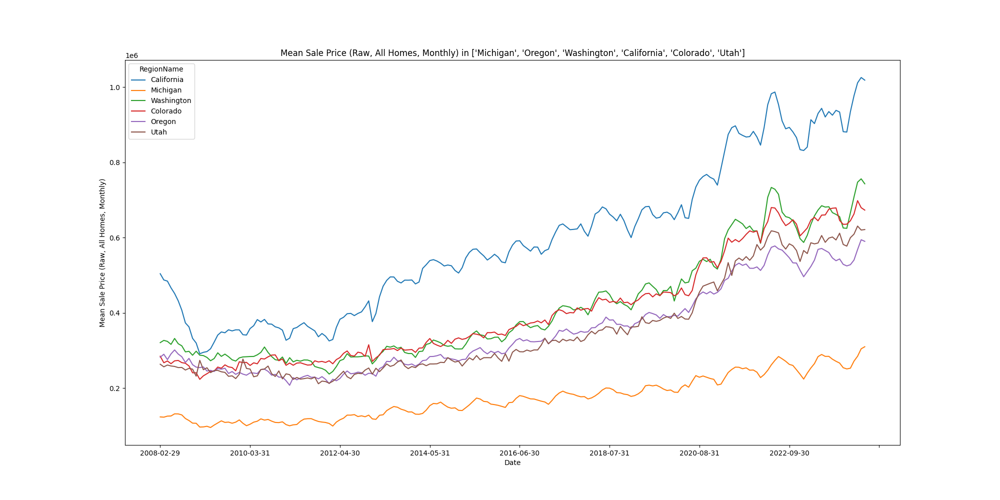

# zillow-public-data
A simple repo which downloads Zillow's public data (no API access required!) and provides some naïve visualization

# Why?
As a first time home buyer data was an important factor for me. Getting Zillow's data was not too hard, but getting it all was a bit teadious. The juypter notebook `download.ipynb` is an attempt to automate the download process. Zillow updates their data monthly and for more details (or manual downloads) you can take a look [here](https://www.zillow.com/research/data/). Some vizualization how-to examples are provided in `viz.ipynb`. 

# Note
The script checks all endpoints against all geography selections. As a result, there is expected that many downloads will fail as the endpoint does not support the geography.
