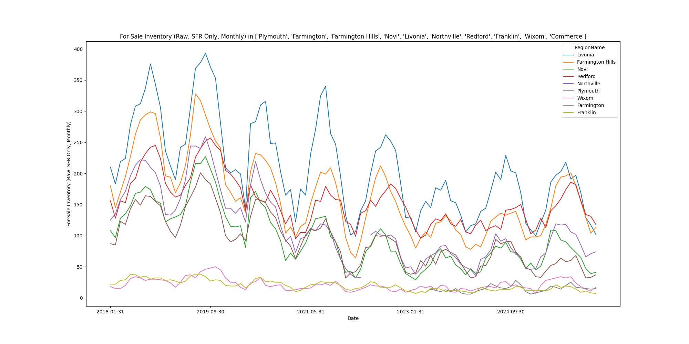
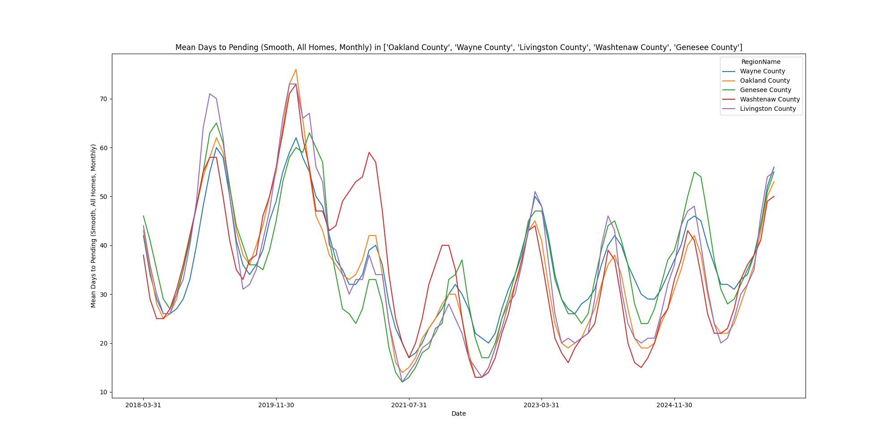
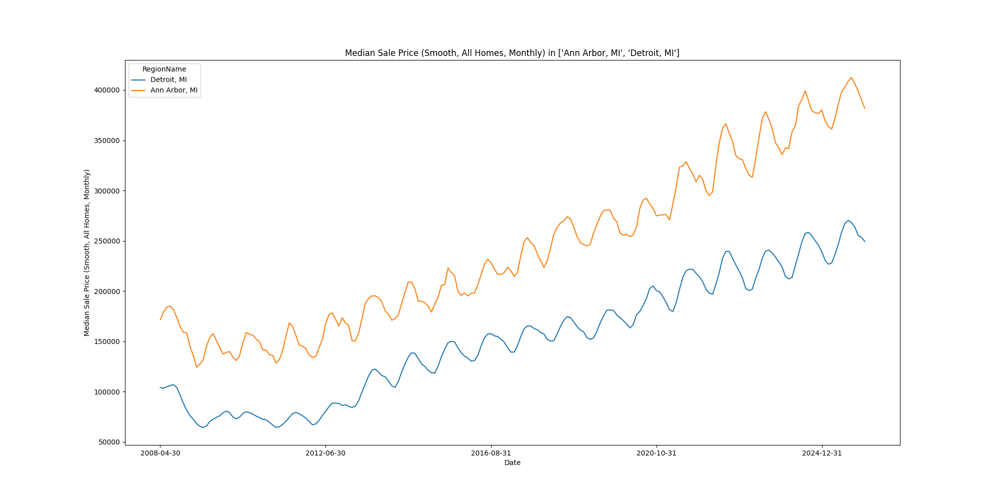
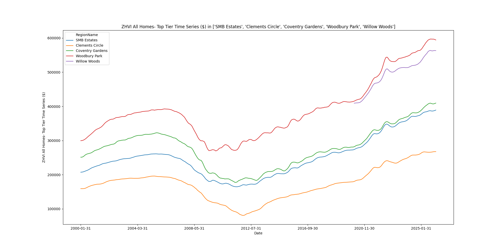
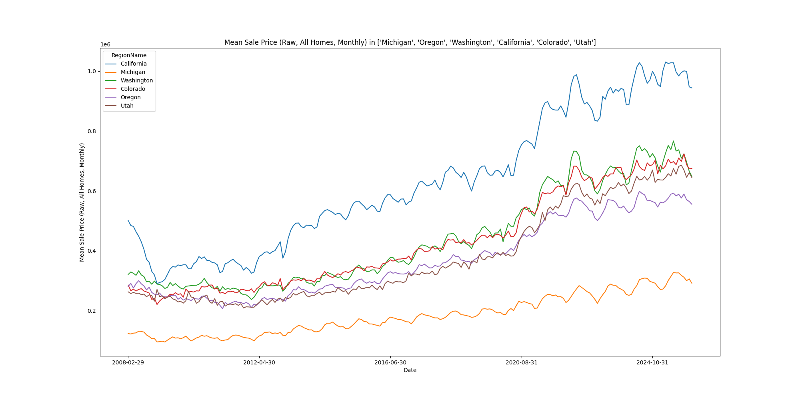

# zillow-public-data
This repository mirrors Zillow’s public CSV feeds (no API key required) and
rebuilds a few example charts so the README can illustrate how the
timeseries evolve.

## Overview

- `doc_urls.pickle` contains the current set of Zillow endpoints plus example
  geographies so the refresh workflow knows which CSVs to request.
- `refresh.py` is the canonical command for downloading the data, filtering out
  unsupported geography combinations, regenerating the example PNGs, and
  reporting the newest available month for a handful of reference series.
- `data/` holds the downloaded CSV corpus; `viz/` contains the full regenerated
  chart set, while the README keeps a curated subset of those PNGs checked in
  so the visual preview stays up to date.
- See `docs/ARCHITECTURE.md` for a concise diagram and description of the
  download → plot workflow.

## Running the refresh

1. `python refresh.py --resume` downloads any missing CSVs while reusing what’s
   already in `./data/`.
2. `python refresh.py --skip-download` regenerates every chart from the current
   `./data/` corpus (use after manually editing CSVs or when you just want new
   proofs without re-downloading).
3. Both commands print `[summary]` and `[latest]` lines so you can confirm the
   run touched all expected datasets and see the newest date in each reference
   CSV.

The helper script already handles partial downloads, Latin-1 encoded CSVs, and
non-numeric rows so rerunning `refresh.py` is the preferred way to keep the repo
in sync. Use `python refresh.py --skip-viz` only when you need to verify the data
download step without generating any charts.

## Visual preview

These PNGs are published in the README as examples and are overwritten when you
regenerate `./viz/`:

## Directory layout

- `refresh.py`: orchestrates the full flow (download + viz generation + summaries +
  architecture logging).
- `doc_urls.pickle`: Zillow endpoint map used by `refresh.py`.
- `data/`: large downloaded CSVs (`zhvi/`, `median_sale_price/`, etc.).
- `viz/`: generated charts for all region/dataset combinations.
- Root PNGs: curated subset kept in sync with the README.
- `docs/ARCHITECTURE.md`: high-level architecture sketch describing how the
  inputs move through `refresh.py`.

## Troubleshooting

- If Zillow adds/removes CSVs, rerun `python refresh.py --resume` so the script can
  skip missing geographies and record what was unavailable.
- If `refresh.py` errors while reading a CSV, the logs now try Latin-1 as a
  fallback and skip non-numeric outputs automatically.
- When the README pixels still look stale, re-run `python refresh.py --skip-download
  --skip-viz` to reconfirm the sampled charts reflect the latest `./data/`.

## Tests

- `pytest tests/test_refresh.py` validates the helper utilities used by
  `refresh.py` (doc map loading, candidate path expansion, date column discovery)
  without making network calls. Run this after touching `refresh.py` or
  `doc_urls.pickle` before pushing.
